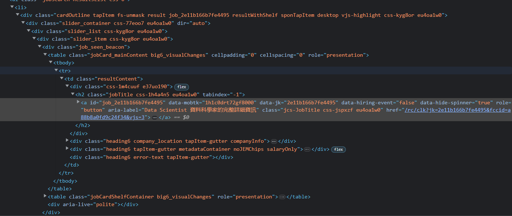

# Mass_Cover_Letter_Writer

Welcome to our GitHub repository, where we introduce an innovative project that combines web crawling and ChatGPT to generate tailored cover letters for job applications at scale. In today's competitive job market, a compelling cover letter can make a significant impact. Our solution automates and streamlines the process, saving time and maximizing success chances.

By leveraging web crawling and ChatGPT, our system gathers information from job postings and generates personalized cover letters. It eliminates the need for extensive research and manual tailoring, allowing users to input their details and receive highly relevant cover letters.

Key advantages of our project include time savings, relevance, and engagement. Users can automate cover letter creation, ensuring letters address specific job requirements effectively. Our solution simplifies the process for job seekers, supporting them in showcasing their skills and experiences.


## Requirements

This project requires Chrome to work. Make sure the chromedriver used by the selenium matches the version of your chrome

```bat
pip install -r requirements.txt
```

## How to Use

1. Open the Jupyter Notebook containing the code for the project.

2. Find the cell lablled with the job site you want and enter the `NAME`, `BASE_URL`, `CV_PATH`, `OPENAI_KEY`, and `Prompt` of your own. `Indeed` & `Glassdoor` have already been provided. If you want this to work with site not included, you would need to figure out the `NEW_URL_CSS` & `NEXT_PAGE_CSS` of that specific site.

	- NAME: Replace "Indeed-Data Science" with a suitable name for the job site. This can be any descriptive name that helps identify the specific job site you are targeting.

	- BASE_URL: Replace "https://ca.indeed.com/jobs?q=data+scientist&fl=&sort=date&vjk=cf4843c2196f979a" with the URL of the job search page on the new job site. This URL should include relevant search parameters or filters to target the desired job positions.

	- NEW_URL_CSS: If needed, replace 'a[aria-label*="full details"]' with the appropriate CSS selector that identifies the links to full job details on the new job site. This ensures that the web crawler can extract the necessary information. Example:

	

	- NEXT_PAGE_CSS: If needed, replace 'a[aria-label="Next Page"]' with the appropriate CSS selector that identifies the link to the next page of job search results on the new job site. This allows the crawler to navigate through multiple pages if necessary. However, a job site does not use a new url for next page, this will not work. I am still figuring this out

	- CV_PATH: Replace "YOUR CV" with the path to your own CV document. Make sure the document is in a format compatible with the code. For example, you can provide the path to a PDF or text file containing your CV.

	- OPENAI_KEY: Replace "YOUR API KEY" with your OpenAI API key. This key enables the integration with ChatGPT for generating the cover letters.

	- Customize the provided prompt template to suit the new job site and the specific cover letter requirements. Modify the text within the triple quotes (""") to tailor the instructions to your needs. You can provide guidelines for each paragraph of the cover letter, including introduction, relevant skills and experiences, problem-solving abilities, and overall writing style. Be sure to align the instructions with the job site's purpose and the desired job position.

3. After you replace all the meta data, scroll to the bottom of the page and execute the last cell. You should see a chrome window popping up, going to different job details and generating cover letter for each of them.

4. At the end, you should be able to go into ```history/{NAME}.csv``` to find all the url + source + meta_data + cover_letter of each of the job

Remember to review the generated cover letters and make any necessary adjustments to ensure they meet your requirements before submitting them with your job applications.
